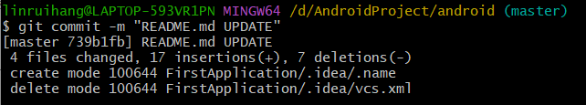
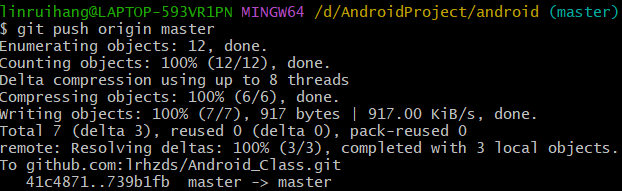
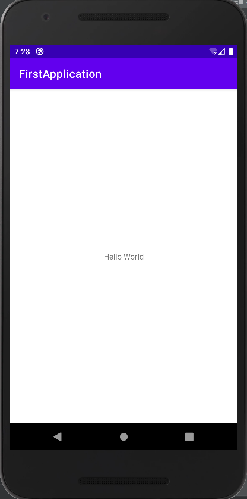

实验1_Android开发基础实验

> 第一次作业报告
- 使用 `Git Bash` 进行同步

  1. **git init**	初始化仓库

  2. **git add .**  上传工程代码

  3. **.ignore**  现在不需要再自己编写了

  4. **git commit -m "commit info"**  提交信息
  
  
  
  4. **git push origin master**   上传到远程仓库
  5. 最终运行效果如图：
  


```xml
<TextView
    android:id="@+id/textView"
    android:layout_width="wrap_content"
    android:layout_height="wrap_content"
    android:text="@string/hello_world"
    app:layout_constraintBottom_toBottomOf="parent"
    app:layout_constraintEnd_toEndOf="parent"
    app:layout_constraintStart_toStartOf="parent"
    app:layout_constraintTop_toTopOf="parent" />
```

- 最终运行成功结果


